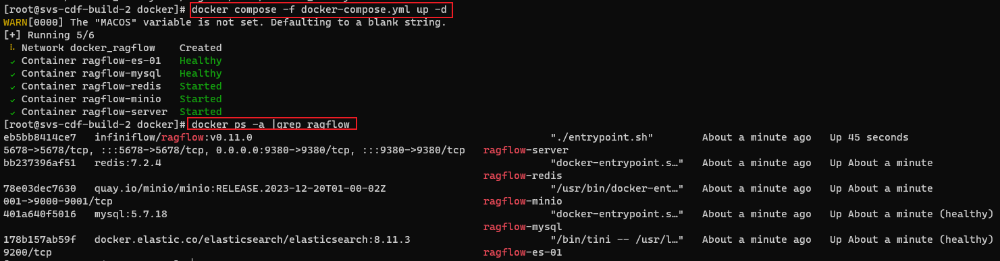
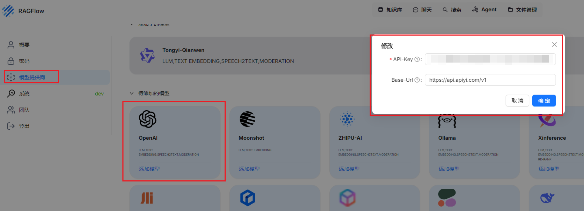
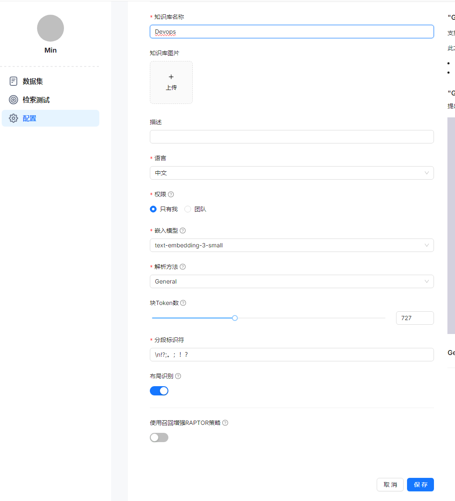
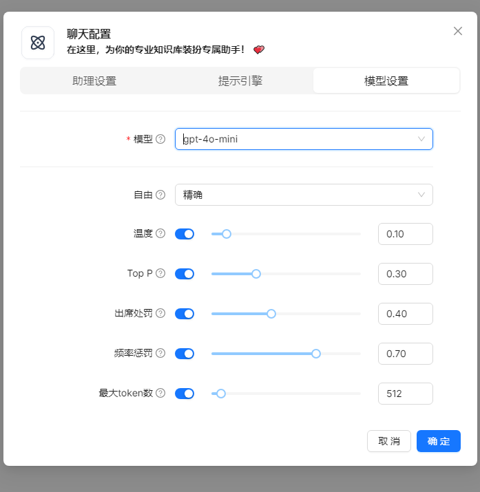
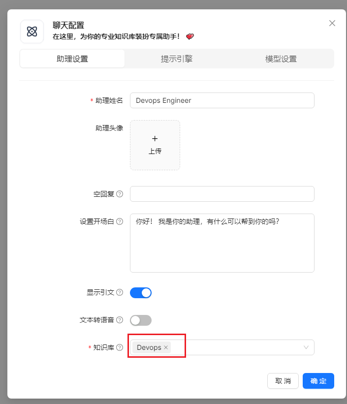
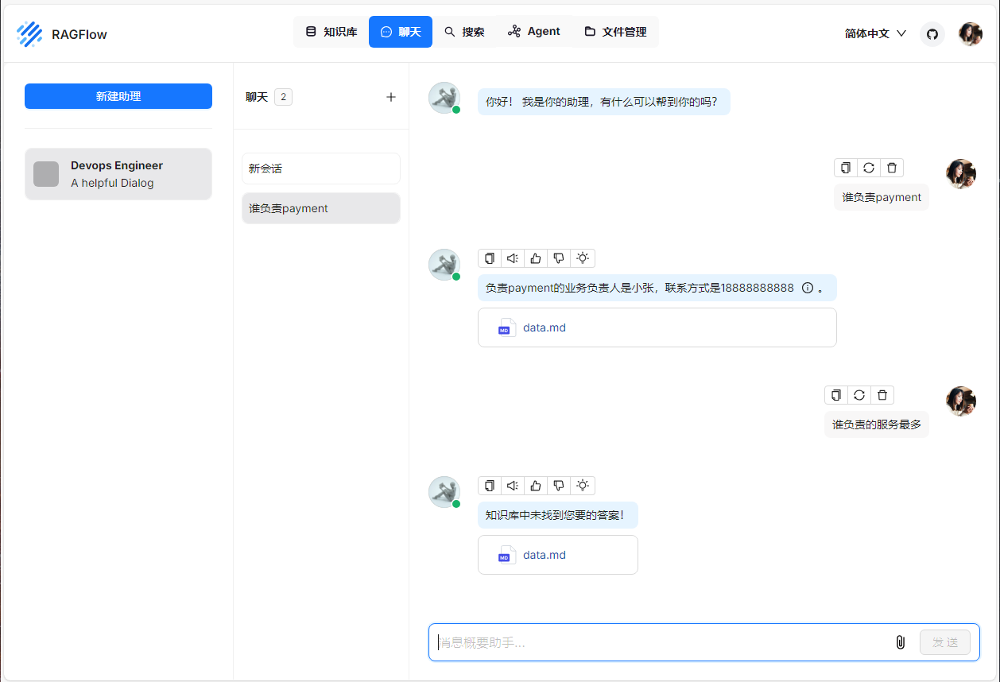

# RAGFlow

```
git clone https://github.com/infiniflow/ragflow.git
cd ragflow/docker
chmod +x ./entrypoint.sh
sed -i "s/RAGFLOW_VERSION.*/RAGFLOW_VERSION=v0.11.0/g" .env
```

<p></p>

<p></p>

<p></p>

<p></p>

<p></p>

<p></p>